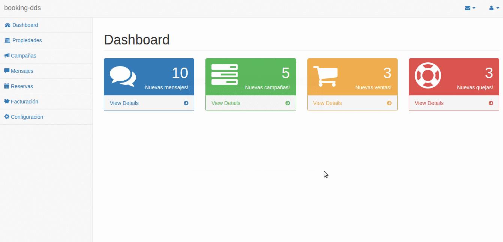

# Sistema de administración de propiedades en Angular



# Pre-requisitos:
- [nodejs + npm](https://nodejs.org/en/download/)
- [bower](https://bower.io/)

# Setup

```bash
$ npm install -g bower
$ bower install
$ npm install
$ npm start (o node server.js)
```
---

Para correr la branch `master` solo hace falta `bower install`. 
En las branch que le siguen (**steps**), requieren tanto `bower install` como `npm install` (además del servidor levantado: `npm start` o `node server.js`)

Tener en cuenta que server se levanta en **http://localhost:3000**

# Enunciado
Para mostrar cómo construir una SPA en Angular elegimos el siguiente dominio:

*“Booking-dds”* es un portal de búsqueda y reserva de estadías en propiedades (hoteles, casas y departamentos particulares). El portal ofrece a dueños de todo el país incluir su propiedad gratuitamente.

Al iniciar la aplicación, debemos mostrar un Dashboard, algo así como un tablero que muestra el estado general de la cuenta:

* Cantidad de mensajes que enviaron personas interesadas en propiedades publicadas por el usuario
* Cantidad de “campañas” o ventas de propiedades publicadas recientemente
* Cantidad de ventas de propiedades efectuadas en el último tiempo
* Cantidad de quejas recibidas por parte de los usuarios

En un menú lateral de opciones varias, debe aparecer la posibilidad de listar las propiedades en venta, que pueden ser

* Hoteles
* Casas particulares
* Pueden agregarse otros ejemplos a futuro
	
Al hacer click en alguna de las propiedades debe navegar hacia una página de edición que debe considerar los datos particulares de cada propiedad. Todas las propiedades tienen dirección, localidad, estado (Abierto, En Refacciones, Cerrado) y descripción. Los hoteles definen la cantidad de estrellas, las casas y departamentos particulares muestran la antigüedad en años y la cantidad de baños que tienen.

# Explicación del ejercicio
Se encuentra en [este apunte](https://docs.google.com/document/d/178YO7zrtzO8qlI5EIoaKkixFx19ONohrTsD0EwmjOAQ/edit?usp=sharing)


# Transformaciones paso a paso
- Creación del layout: [step-1](https://github.com/uqbar-project/eg-propiedades-angular/commit/f99b8789ee5e899821aef6a0ca9b242bed762520)
- Directiva cajita: [directiva](https://github.com/uqbar-project/eg-propiedades-angular/commit/75f123a556cf1a295f370e20d9a5150225f11279)
- ABML de propiedades con switch: [switch](https://github.com/uqbar-project/eg-propiedades-angular/commit/d9131c0ad70e95d23b6866a67c7d6e03fbfb9f35)
- Reutilizacion de vista: [una sola vista](https://github.com/uqbar-project/eg-propiedades-angular/commit/a586da721039db3a4d6abf7e4c007f86bbe8fdf6)
- Reemplazo switch por state, agregando vista anidada: [vista anidada](https://github.com/uqbar-project/eg-propiedades-angular/commit/48eb0df000066cfa82d83fb9e84021198e27d4f6)
- Reutilizo controllers: [un solo controller](https://github.com/uqbar-project/eg-propiedades-angular/commit/7ea972899e124d12dd9d609110934210136205d4)
